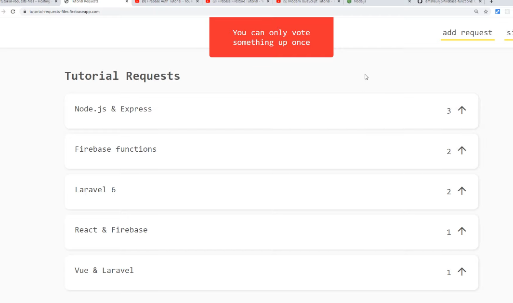
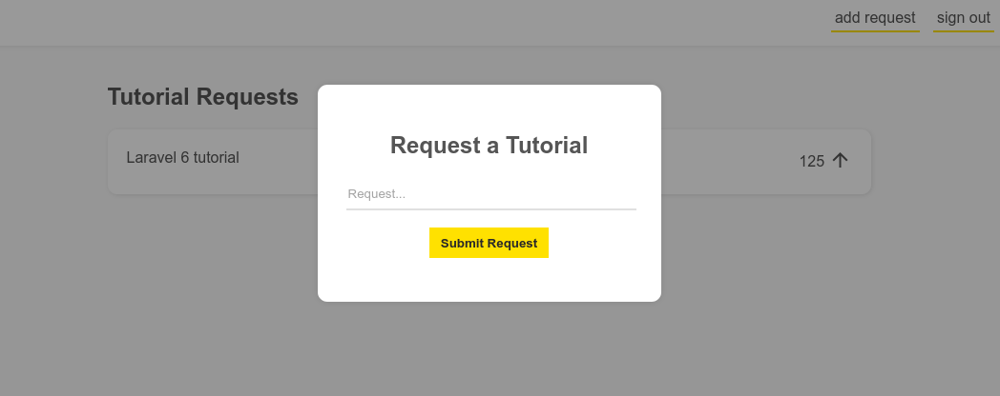
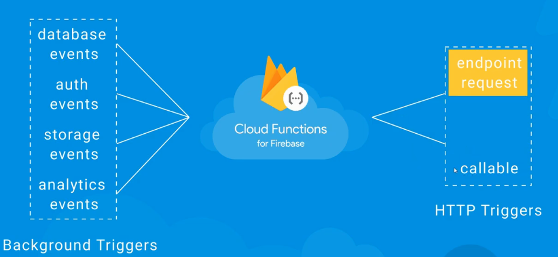

# firebase-practice

Following [this tutorial](https://www.youtube.com/watch?v=udHm7I_OvJs&list=PL4cUxeGkcC9i_aLkr62adUTJi53y7OjOf)
by The Net Ninja on YouTube.

References: https://github.com/iamshaunjp/firebase-functions/

## 01. Introduction

We will create use Auth, Firestore to create a website. Firebase Cloud
Functions will allow us to perform database operations from a trusted source
with backend validation.



## 02. Setup

Firebase init:
* Firestore
* Functions
* Hosting
* Emulators

View the website using `firebase serve`

## 03. HTML template

An input form/modal will pop up when we add a new request (for a tutorial). It
will close when the background is clicked on (and not the form box).



## 04. Creating and Deploying a Function

There are a number of triggers that can be used for a function. We will be
using a HTTP trigger.



We will create a simple random number function in
[functions/index.js](functions/index.js).
```js
const functions = require('firebase-functions');

// Return random number
exports.randomNumber = functions.https.onRequest((req, res) => {
  const number = Math.round(Math.random() * 100)
  console.log(`LOGGING NUMBER (${number}) TO FIREBASE CONSOLE!`)
  res.send(number.toString())
})

// Redirect to website
exports.toTheDojo = functions.https.onRequest((req, res) => {
  res.redirect('https://www.thenetninja.co.uk')
})
```

Now we can deploy our functions:
```bash
firebase deploy --only functions
```

If you get `Error: Cloud Functions deployment requires the pay-as-you-go (Blaze) billing plan.`,
use the Blaze billing plan (functions is no longer free for Node 10 and Node 8
will be decommissioned in 03/2020).

## 05. Callable Functions

We created a HTTP endpoint function. Now we will create a callable function,
which is meant to be called using our code.

Callable functions are the same as HTTP, but it does some extra work for you:
* On client
  * Handling CORS with the request
  * Sending authenticated user token
  * sending device instance ID
  * Serializing input object from the client
  * Deserialising response object in the client
* On backend:
  * Validating the user token
  * Deserialising input object
  * Serialising response object

`functions/index.js` (define the callable function)
```js
// Callable function
exports.sayHello = functions.https.onCall((data, context) => {
  const name = data.name
  return `Hello ${name}!`
})
```

`public/js/app.js` (call the function with input data)
```js
// say hello function call
const button = document.querySelector('.call')
button.addEventListener('click', () => {
  // get function reference
  const sayHello = firebase.functions().httpsCallable('sayHello')
  // invoke function (async function / promise)
  sayHello({ name: 'Mark' }).then(result => {
    alert(result.data);
  })
})
```

## 06. Auth Model Templates

Hooking up Auth to the functions.

We will create a Model for login and a model for registration, and add
appropriate CSS.
```html
  <div class="auth open">

    <div class="modal active">
      <h2>Login</h2>
      <form class="login">
        <input type="text" name="email" placeholder="Email">
        <input type="password" name="password" placeholder="Password">
        <button>Login</button>
        <p class="error"></p>
      </form>
      <div>No account? <a class="switch">Register instead</a></div>
    </div>

    <div class="modal">
      <h2>Register</h2>
      <form class="register">
        <input type="text" name="email" placeholder="Email">
        <input type="password" name="password" placeholder="Password">
        <button>Register</button>
        <p class="error"></p>
      </form>
      <div>Got an account? <a class="switch">Login instead</a></div>
    </div>
  </div>
```
For now, we will only add JavaScript for switching between login and register.

## 07. Firebase Authentication

We will enable the Email signin method in the Firebase console.

We can add event listeners and the Firebase Auth async functions to login,
signup, automatically signin, and manage error messages.
```js
// Login form
loginForm.addEventListener('submit', (e) => {
  e.preventDefault();
  const email = loginForm.email.value;
  const password = loginForm.password.value;
  firebase.auth().signInWithEmailAndPassword(email, password)
    .then((user) => {
      console.log('Logged in', user);
      loginForm.reset();
    })
    .catch((error) => {
      loginForm.querySelector('.error').textContent = error.message;
    });
});

// Display the auth modal when the the user logs in/out
firebase.auth().onAuthStateChanged((user) => {
  if (user) {
    authWrapper.classList.remove('open');
    authModals.forEach(modal => modal.classList.remove('active'))
  } else {
    authWrapper.classList.add('open');
    authModals[0].classList.add('active');
  }
});

// Sign out button
signOut.addEventListener('click', () => {
  firebase.auth().signOut();
});
```

## 08. Auth Triggers

We will remove old HTTP and callable functions.

We will create auth triggers that log when a new user is created/deleted.

```js
// Auth trigger (new user signup)
exports.newUserSignup = functions.auth.user().onCreate((user) => {
  console.log('User created', user.email, user.uid);
});

// Auth trigger (user deleted)
exports.userDeleted = functions.auth.user().onDelete((user) => {
  console.log('User deleted', user.email, user.uid);
});
```

These functions are not called by the client, but it will raise a warning log
because it expects a Promise or value regardless. We will address this next.